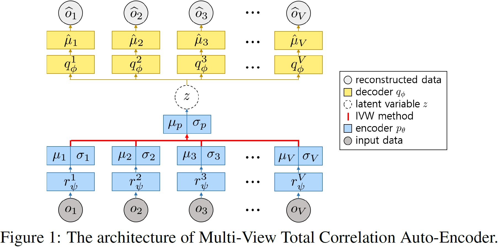
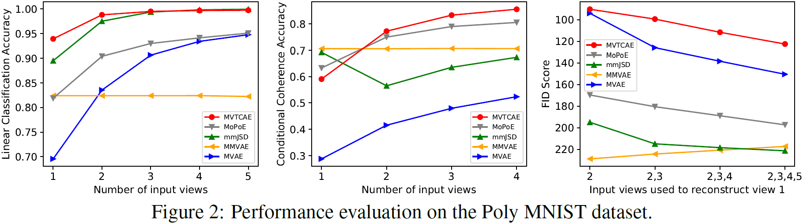

# Multi-View Total Correlation Auto-Encoder


The official implementation for the NeurIPS 2021 paper "Multi-View Representation Learning via Total Correlation Objective".

#### 1. Prerequisites

First of all, please download PolyMNIST dataset, pretrained classifiers, and inception network [here](https://zenodo.org/record/4899160#.YLn0rKgzaHu) and unzip them under the data directory.
Please note that all the material downloaded are from the official implementation of MoPoE-VAE.

Then, install following libraries and packages:

- Python version 3.5.6
- PyTorch version 1.4.0
- CUDA version 11.0
- The conda environment defined in `environment.yml`

Alternatively, you can do following steps for easier installation:
```bash
conda env create -f environment.yml  # create conda env
conda activate mvtcae                # activate conda env
```

#### 2. Train & evaluate MVTCAE

Experiments can be started by running main_mmnist.py as follows:

```bash
python main_mmnist.py
```

To choose among running the MVAE, MMVAE, mmJSD, MoPoE-VAE, and MVTCAE,
you need to change the value of variable `METHOD` in main_mmnist.py to 'poe', 'moe', 'jsd', 'joint\_elbo', or 'tc' respectively.

By default, each experiment uses `METHOD='tc'`.

You can find evaluation results in the tensorboard log saved in exp_poly directory.


#### 3. Results




#### 4. Notes

All the results are averaged over 5 different seeds (0~4).
